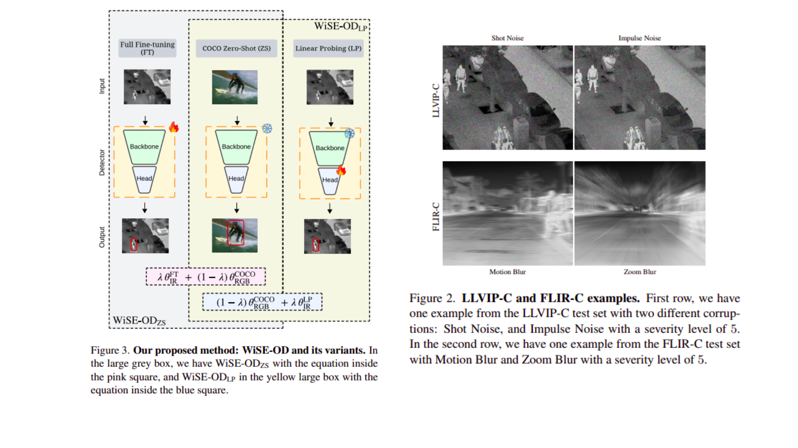
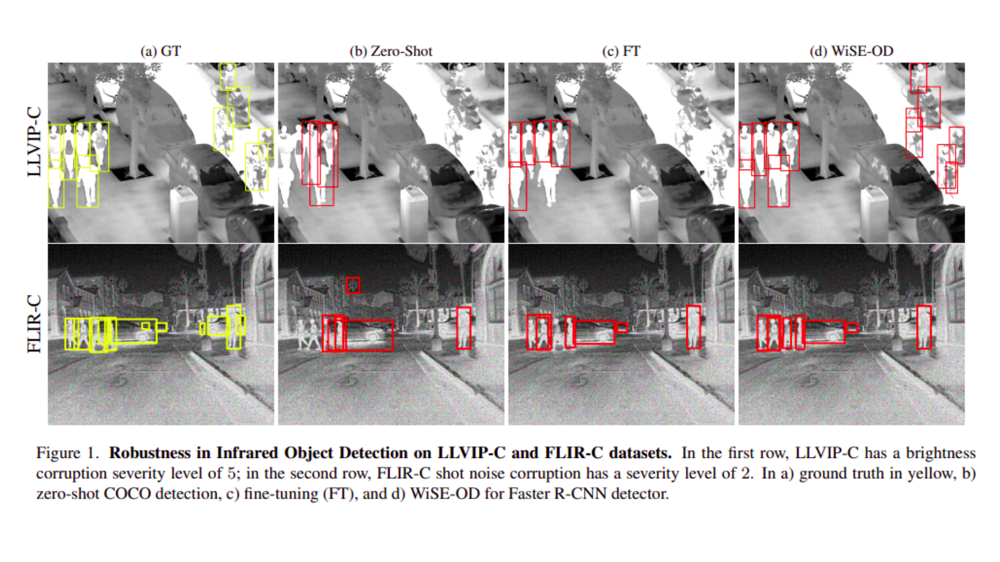
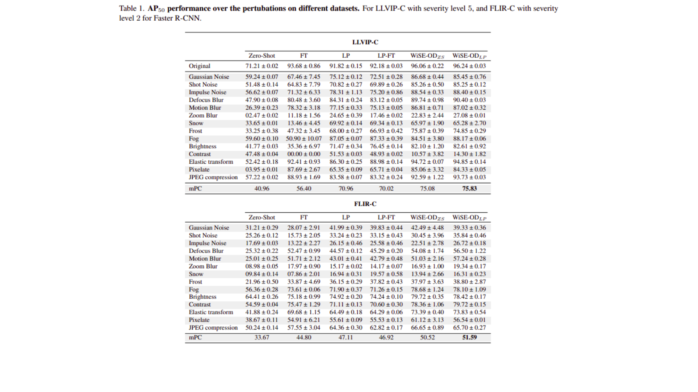

# WiSE-OD: Benchmarking Robustness in Infrared Object Detection

This is the repository for our paper WiSE-OD: Benchmarking Robustness in Infrared Object Detection 🔗 by Heitor R. Medeiros, Atif Belal, Masih Aminbeidokhti, Eric Granger, Marco Pedersoli.

## Abstract

Object detection (OD) in infrared (IR) imagery is critical for low-light and nighttime applications. However, the scarcity of large-scale IR datasets forces models to rely on weights pre-trained on RGB images. While fine-tuning on IR improves accuracy, it often compromises robustness under distribution shifts due to the inherent modality gap between RGB and IR. To address this, we introduce LLVIP-C and FLIR-C, two cross-modality out‑of‑distribution (OOD) benchmarks built by applying corruption to standard IR datasets. Additionally, to fully leverage the complementary knowledge from RGB and infrared trained models, we propose WiSE-OD, a weight-space ensembling method with two variants: WiSE-OD$_{ZS}$, which combines RGB zero-shot and IR fine-tuned weights, and WiSE-OD$_{LP}$, which blends zero-shot and linear probing. Evaluated across three RGB-pretrained detectors and two robust baselines, WiSE-OD improves both cross-modality and corruption robustness without any additional training or inference cost.

## News

 - The paper is under review.
 - The code will be released when the paper is accepted.
 - If you have any problems or questions, please feel free to contact us!

## WiSE-OD 

## Benchmarking

